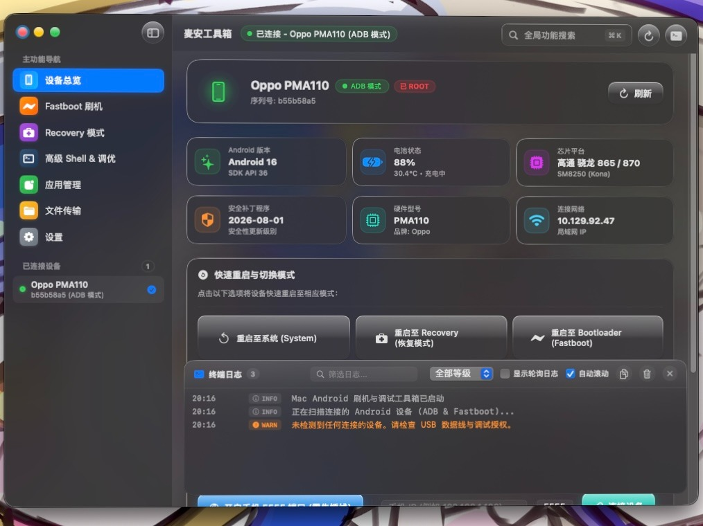

# 麦安工具箱 (MacAndroidToolbox)

[English](README_EN.md) | **简体中文**

[](https://github.com/Cometphotograph/MacAndroidToolbox)
[](https://swift.org)
[](https://www.apple.com/macos)
[-purple.svg)](https://apple.com)
[](https://space.bilibili.com/432147890?spm_id_from=333.337.0.0)
[](mailto:magicalgirlkrea@gmail.com)
[](https://github.com/Cometphotograph/MacAndroidToolbox)
[](https://developer.apple.com)
[](LICENSE)

专为 **macOS** 用户量身打造的现代化原生 Android 刷机与调试图形化工具箱。使用 **Swift 6** 与 **SwiftUI** 开发，全面采用 **Liquid Glass（液态玻璃拟真视觉风格）** 设计语言，深度融合 Apple 人机界面指南（Human Interface Guidelines, HIG），具备高透光率、多图层景深毛玻璃、动态流光与细腻质感。

<p align="center">
  
</p>

---

## ⚠️ 重要声明与安全警示

> [!CAUTION]
> ### 1. 开源与严禁倒卖声明
> **本软件完全遵循开源规范免费公开，严禁任何个人、机构或组织以任何形式进行转售、倒卖、收费分发或捆绑付费商业软件！**  
> 若您是通过任何付费渠道购买获得本软件，请立即要求退款并向相关平台进行举报。

> [!WARNING]
> ### 2. 刷机与底层操作免责声明
> 刷机、解锁 Bootloader、获取 Root 权限、擦写底层分区以及执行系统级调试具有一定的客观风险，可能导致设备出现软砖或硬砖（无法开机）、数据永久丢失、厂商硬件保修失效或硬件安全特性受损。  
> **在进行任何刷写与修改操作前，请务必完整备份设备内的所有重要个人数据。**  
> 本软件及开发者不对因操作不当、硬件固件差异或第三方定制系统兼容性造成的任何直接或间接损失承担法律或赔偿责任。

> [!IMPORTANT]
> ### 3. 优先建议官方渠道解锁 Bootloader
> 强烈建议用户尽可能优先通过手机厂商官方提供的授权渠道进行 Bootloader 解锁（特别是搭载小米澎湃 OS / HyperOS、OPPO ColorOS、vivo OriginOS、魅族 Flyme 等第三方深度定制系统的机型）。  
> 尝试通过非官方漏洞或暴力手段绕过解锁限制，极易导致 CPU 熔丝异常、TEE（可信执行环境）及指纹/面部硬件安全模块永久受损、基带丢失甚至主板报废。

---

## ✨ 核心功能模块

### 📱 1. 设备仪表板与状态总览 (Dashboard)
* **智能连接模式识别**：自动实时侦测设备连接状态（ADB 调试模式、Fastboot 引导模式、FastbootD 用户空间分区模式、Recovery 恢复模式、Sideload 旁推模式、Qualcomm 9008 模式及未授权状态）。
* **全面硬软件规格展示**：品牌、设备型号、硬件代号、Android 系统版本、API 等级、安全补丁更新日期。
* **实时硬件传感器监控**：电池剩余电量百分比、电池实时温度（°C）、充放电工作状态。
* **芯片平台智能识别**：内置常见 SoC 数据库，智能解析高通骁龙（Snapdragon 全系列）、联发科天玑（Dimensity 全系列）、谷歌 Tensor、三星 Exynos、华为海思麒麟及紫光展锐等商业发布名称与底层芯片代号。
* **Root 权限状态探针**：自动侦测底层 Root 授权状态（Magisk / KernelSU / APatch / SU）。
* **快捷重启控制台**：正常重启系统、重启至 Bootloader/Fastboot 模式、重启至 Recovery 恢复模式、重启至 FastbootD 模式。
* **无线 ADB 配对向导**：支持一键开启 TCP/IP 5555 调试端口，摆脱数据线束缚，支持通过 IP 与端口号无线连接管理。

---

### ⚡️ 2. Fastboot 专业刷机与分区管理 (Fastboot Flasher)
* **常用分区一键刷写**：
  - 支持核心分区：`boot`、`init_boot`（Android 13+ 全新架构必备）、`recovery`、`vbmeta`、`vendor_boot`、`system`、`vendor`、`super`、`dtbo` 等。
  - 支持自定义任意分区名称快速刷入。
  - **AVB 验证停用**：针对 `vbmeta` 分区提供一键 `--disable-verity --disable-verification` 免校验标志。
  - 支持直接拖拽 `.img`、`.bin` 文件或通过系统文件选择器选取。
* **临时镜像引导启动 (Fastboot Boot)**：
  - 执行 `fastboot boot <image>`：无需刷写写入硬盘，即可临时启动 TWRP、OrangeFox 恢复模式或 Magisk 修补核心进行环境测试与临时提权。
* **A/B 槽位无感切换**：
  - 即时侦测当前活跃分区槽位（Slot A 或 Slot B），支持一键无感切换。
* **Bootloader 解锁与回锁**：
  - 支持现代标准解锁协议（`flashing unlock`）、关键分区解锁（`flashing unlock_critical`）及传统解锁（`oem unlock`）。
  - 支持官方原厂固件回锁（`flashing lock` / `oem lock`）。
  - 内置二次防误触安全校验确认。
* **分区格式化与深度擦除**：
  - 支持 `userdata`、`cache`、`metadata` 等核心分区一键格式化与擦除，救砖必备。
* **Fastboot 变量全景查看器**：
  - 读取完整的 `fastboot getvar all` 底层参数，支持关键词即时过滤搜索。

---

### 🧯 3. Qualcomm 9008 深度救砖与底层刷机 (Qualcomm EDL 9008)
* **USB 硬件级 9008 模式自动侦测**：通过 macOS 底层 IOKit 毫秒级快速识别处于 Emergency Download（VID `0x05c6` PID `0x9008` / `0x900e`）状态的高通设备。
* **内置 192 款高通免授权引导库 (Firehose Loaders)**：
  - 内置覆盖 **小米、欧加 (OPPO/一加/真我)、魅族、黑鲨、努比亚 (红魔/中兴)、联想 (拯救者/Moto)、华硕 (ROG)、LG** 八大品牌，支持从骁龙 625/835 到骁龙 8 Gen 1/2/3/4 及 8 至尊版（8 Elite）的完整免授权 Firehose 编程器。
  - 支持机型与芯片关键词秒级模糊搜索，自动识别并配置签名凭证（`Digest.elf` 与 `Sign.bin`）。
* **一键「发送引导 (Sahara 握手)」**：
  - 点击「发送引导」即可通过底层 Sahara 协议将 Firehose Programmer 加载至设备内存并切换至就绪模式。
  - 内置握手避坑指南（多引导轮换、长按电源键释放端口连接、排除签名测试等）。
* **QFIL 仿真全盘线刷**：
  - 完整支持高通官方原厂 `rawprogram*.xml` 分区表映射与 `patch*.xml` 扇区补丁。
  - 支持 UFS（现代主流）与 eMMC 闪存颗粒类型，支持自动关联整套固件镜像。
* **单物理分区直接擦写与导出**：
  - 支持向单个物理分区（`boot`、`init_boot`、`recovery`、`vbmeta`、`modem`、`abl`、`xbl`、`super`、`persist` 等）直接写入镜像。
  - 支持一键提取导出任意分区进行底层无损备份。
  - 支持安全擦除故障分区。
* **GPT 物理分区表探针 (Print GPT)**：
  - 直连闪存颗粒读取底层 GPT 结构，实时展示各物理分区的名称、起始扇区、结束扇区与容量，支持关键词即时过滤搜索。
* **一键退出 9008 模式**：发送底层复位指令（`edl reset`），安全重启退出紧急下载状态。
* **环境自检与实战救砖指南**：
  - 自动检测 Python 3、底层驱动 `libusb` 与 `edl` 核心套件状态，支持一键自动化安装环境。
  - 内置按键组合、命令行指令、EDL 工程线与主板短接点（Test Point）详尽实战救砖指南。

---

### 📦 4. 应用管理与 APK 部署 (App Manager)
* **应用分类与极速搜索**：支持按「全部应用」、「第三方用户应用」与「系统内置应用」分类筛选，支持包名及应用名即时搜索。
* **多格式安装支持**：支持拖拽或选取 `.apk`、`.apks`、`.xapk` 等安装包一键静默部署。
* **丰富应用控制操作**：启动应用、强行停止进程、清除应用缓存与数据、卸载应用、停用/冻结系统应用。
* **APK 逆向提取导出**：一键将设备上已安装的任意第三方或系统应用 APK 提取并保存至 Mac 本地。

---

### 📁 5. 文件管理与 Recovery Sideload (Files & Sideload)
* **远程设备文件浏览器**：直观浏览 Android 设备内置存储空间（`/sdcard/Download`、相册、文档等）。
* **双向极速传输**：
  - **推送到设备 (Push)**：Mac 本地文件一键传输至手机指定目录。
  - **导出到 Mac (Pull)**：手机内文件快速导出至 Mac 本地。
* **Recovery Sideload 刷机支持**：
  - 支持在 Recovery 模式下通过 `adb sideload` 刷写官方 OTA 增量包、全量 ROM 固件或 Magisk / KernelSU / APatch 模块。
  - 实时监控 Sideload 传输与刷写进度。

---

### 💻 6. Shell 终端与系统微调 (Shell & Tweaks)
* **交互式 ADB Shell 终端**：原生终端体验，实时执行任何 Linux/Android 命令行指令，支持日志自动滚动与一键清空/复制。
* **实用系统级微调 (Tweaks)**：
  - 一键开启原生隐藏开发者设置与系统界面调节器。
  - 调整系统窗口/过渡/动画时长倍率（0.5x、1.0x、完全关闭）。
  - 停用系统温控配置（方便游戏高帧率压力测试）。
  - 解锁部分机型强制全局高刷新率。

---

### 🔰 7. 首次启动向导与环境自动配置 (Onboarding)
* **环境依赖自动检测**：自动侦测系统内 `adb` 与 `fastboot` 二进制文件与 Homebrew 包管理器安装状态。
* **一键无感安装**：若检测到 Homebrew 但缺失 Android 工具包，支持在界面中一键通过 Homebrew 安装 `android-platform-tools`，实时输出安装日志。
* **浏览器直达与脚本复制**：未安装 Homebrew 时，提供一键打开官网（`brew.sh`）或复制终端安装命令。
* 可在「设置」中随时重新唤起环境检测。

---

### 🎨 8. 现代外观与主题自适应 (Appearance Themes)
* **三档外观自由选择**：
  - 浅色模式 (Light Mode)
  - 深色模式 (Dark Mode)
  - 跟随系统 (Follow System)
* **实时系统联动**：监听 macOS `AppleInterfaceThemeChangedNotification`，在跟随系统模式下随 macOS 昼夜交替实时无缝切换，无需重启应用。

---

### 🌐 9. 多语言国际化支持 (Supported Languages)

麦安工具箱内置全功能国际化语言系统，无需重启即刻实时切换界面语言。目前完整支持以下语言：

* 繁體中文 (Traditional Chinese)
* 简体中文 (Simplified Chinese)
* English (英语)
* Français (法语)
* 日本語 (Japanese)
* Español (西班牙语)
* 한국어 (韩语)
* Русский (俄语)
* Українська (乌克兰语)

---

## 🖥️ 平台及环境需求

### 运行环境
1. **操作系统**：macOS 26.0 或更高版本。
2. **硬件架构**：仅支持 Apple Silicon 原生架构（arm64，包括 M1 / M2 / M3 / M4 / M5 等 M 系列芯片），不支持传统 Intel (x86_64) 处理器。
3. **Android 依赖库**：
   - 依赖 Google 官方 `adb` 与 `fastboot` 工具。
   - 可直接使用软件内的「一键安装」功能，或在终端通过 Homebrew 手动安装：
     ```bash
     brew install --cask android-platform-tools
     ```
   - 亦可在软件「设置」->「工具路径」中自定义手动指定 `adb` / `fastboot` / `edl` 路径。

### 源码编译环境（开发者适用）
- macOS 26.0+
- Swift 6.0+
- Command Line Tools 或 Xcode：
  ```bash
  xcode-select --install
  ```

---

## 📥 下载与安装

### 方式 1：💿 DMG 光盘映像安装（推荐）
1. 在 [Releases](../../releases) 页面下载最新发布的 `MacAndroidToolbox_v1.4.0.dmg`。
2. 双击打开挂载 DMG 镜像。
3. 将 `MacAndroidToolbox.app` 拖入 `Applications`（应用程序）文件夹即可完成安装。

### 方式 2：🛠️ 从源码自行编译与打包
```bash
# 1. 克隆代码仓库
git clone https://github.com/Cometphotograph/MacAndroidToolbox.git
cd MacAndroidToolbox

# 2. 一键执行自动化构建与打包（将自动生成 .app 与 .dmg 并输出至 releases/ 目录）
./build_app.sh

# 3. 运行已打包的应用
open "releases/MacAndroidToolbox_v1.4.0.app"
```

---

## 📄 开源许可证

本项目采用 [MIT 许可证](LICENSE) 进行开源。所有代码遵循开源规范免费公开。
